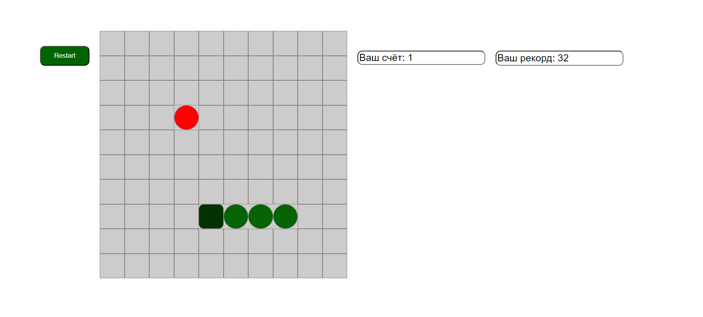

# Snake

Этот проект представляет собой реализацию классической игры "Snake". Игрок управляет змеёй, которая растёт, поедая еду, и старается не столкнуться с границами или собственным телом. Игра разработана с использованием JavaScript, HTML и CSS.

## Содержание

- [Технологии](#технологии)
- [Начало работы](#начало-работы)
- [Использование](#использование)
- [Фотки игры](#фотки-игры)
- [Вопросы](#вопросы)


## Технологии

- Javascript
- CSS
- HTML

## Начало работы

1. Клонируйте репозиторий:
    ```bash
    git clone https://github.com/Allex2689/snake.git
    ```

2. Перейдите в директорию проекта:
    ```bash
    cd snake
    ```

3. Запустите игру, открыв `index.html` в браузере. 

## Использование
Используйте клавиши со стрелками на клавиатуре для управления змеёй:

- Вверх: `Arrow Up`
- Вниз: `Arrow Down`
- Влево: `Arrow Left`
- Вправо: `Arrow Right`

## Фотки игры




